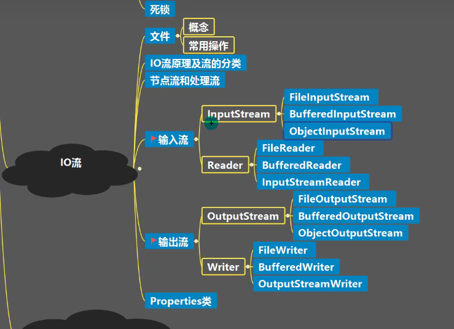
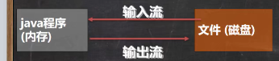
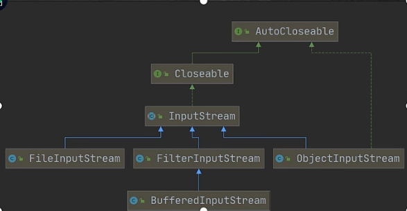
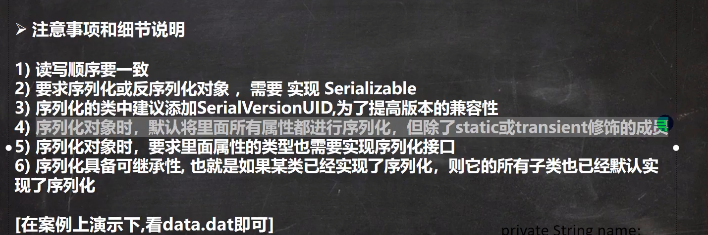

# IO流



## 文件




> 常用操作：

创建文件：

```java
new File(String pathname)//根据路径构建一个File对象
new File(File parent,String child)//根据父目录文件+子路径构建
new File(String parent,String child)//根据父目录+子路径构建

createNewFile 创建新文件
```


获取文件相关信息：

```java
public void getinfo() {

        File file = new File("C:\\Users\\30992\\Desktop\\IOtest\\new1.txt");

        System.out.println("文件名字="+file.getName());
        System.out.println("文件绝对路径="+file.getAbsolutePath());
        System.out.println("文件父级目录="+file.getParent());
        System.out.println("文件大小="+file.length());
        System.out.println("文件是否存在="+file.exists());
        System.out.println("是不死一个文件="+file.isFile());
        System.out.println("是不是一个目录="+file.isDirectory());


    }
```


文件目录：

```java
    public void m1(){
        String pathname = "C:\\Users\\30992\\Desktop\\IOtest\\1\\2\\3";

        File file = new File(pathname);

        if (file.exists()){
            System.out.println("文件已存在");
        }else {
            if (file.mkdirs()){
                System.out.println(pathname+"创建成功...");
            }else {
                System.out.println(pathname+"创建失败...");
            }
        }
    }
```


## IO流原理及流分类

数据单位分：

字节流（8bit）

字符流（按字符）


数据流方向：

输入流

输出流


按流的角色：

节点流

处理流/包装流

| 抽象基类 | 字节流       | 字符流 |
| -------- | ------------ | ------ |
| 输入流   | InputStream  | Reader |
| 输出流   | OutputStream | Writer |


## 字节流和处理流


InputStream:字节输入流

### InputStream常用子类

1.FileInputStream：文件输入流

2.BufferedInputStream：缓冲字节输入流

3.ObjectInputStream：对象字节输入流




1.输入流FileInputStream（字节流） FileReader（字符流）

```java

//字节流
public void m1() throws IOException {
        String filepath = "C:\\Users\\30992\\Desktop\\IOtest\\hello.txt";

        FileInputStream inputStream = new FileInputStream(filepath);

        int readData = 0;

        while ((readData = inputStream.read())!= -1){
            System.out.print((char)readData);
        }

        inputStream.close();
    }
}
```

```java
public void m2() throws IOException {
    String filepath = "C:\\Users\\30992\\Desktop\\IOtest\\hello.txt";

    FileInputStream inputStream = new FileInputStream(filepath);

    byte[] buf = new byte[8];
    int readData = 0;

    while ((readData = inputStream.read(buf))!= -1){
        System.out.print(new String(buf,0,readData));
    }

    inputStream.close();
}
```

2.输出流FileOutputStream（字节流） FileWriter（字符流）

```
public void m1() throws IOException {
    FileOutputStream fileOutputStream = new FileOutputStream("C:\\Users\\30992\\Desktop\\IOtest\\a.txt",true);

    String str = "nihao";
    fileOutputStream.write(str.getBytes());

    fileOutputStream.close();
}
```

3.BufferedInputStream BufferedOutputStream

```java
		String src = "C:\\Users\\30992\\Videos\\Captures\\1.jpg";
        String des = "C:\\Users\\30992\\Desktop\\IOtest\\1.jpg";

        BufferedInputStream bufferedInputStream= new BufferedInputStream(new FileInputStream(src));
        BufferedOutputStream bufferedOutputStream = new BufferedOutputStream(new FileOutputStream(des));

        byte[] bytes = new byte[1024];
        int readData = 0;
        while ((readData = bufferedInputStream.read(bytes))!=-1){
            bufferedOutputStream.write(bytes,0,readData);
        }

        bufferedInputStream.close();
        bufferedOutputStream.close();
```

###  序列化和反序列化

1.序列化是在保存数据时，保存数据的值和数据类型

2.反序列化是在恢复数据时，恢复数据的值和数据类型

3.需要让某个对象支持序列化机制，必须让其类可序列化，为了让某个类可序列化，该类必须实现如下两个接口之一

​	Serializable //标记接口，没有方法

​	Externalizable//该接口有方法需要实现，因此一般实现上面的Serializable

### 节点流和处理流

ObjectOutputStream提供序列化功能

ObjectInputStream提供反序列化功能



```java
public class ObjectOutStream_ {
    @Test
    public void me1()throws Exception{
        String path = "C:\\Users\\30992\\Desktop\\IOtest\\data.dat";
        ObjectOutputStream oos = new ObjectOutputStream(new FileOutputStream(path));

        oos.write(100);
        oos.writeBoolean(true);

        oos.writeObject(new Dog("旺财","heihei"));

        oos.close();

        System.out.println("数据序列化完毕");
    }

    @Test
    public void me2()throws Exception{
        String path = "C:\\Users\\30992\\Desktop\\IOtest\\data.dat";
        ObjectInputStream ois = new ObjectInputStream(new FileInputStream(path));

        System.out.println(ois.read());
        System.out.println(ois.readBoolean());
        Object dog = ois.readObject();
        System.out.println(dog.getClass());
        System.out.println(dog);
        System.out.println("数据反序列化完毕");

        Dog dog1 = (Dog) dog;

        System.out.println(dog1.getName());
    }
}
class Dog implements Serializable {
    private String name;
    private String voice;

    public Dog(String name, String voice) {
        this.name = name;
        this.voice = voice;
    }

    public String getName() {
        return name;
    }
}
```

### 转换流

InputStreamReader和OutputStreamWriter 

```java
@Test
    public void m5() throws Exception {
        //读取文件C:\Users\30992\Desktop\IOtest
        String path = "C:\\Users\\30992\\Desktop\\IOtest\\a.txt";
        InputStreamReader isr = new InputStreamReader(new FileInputStream(path),"gbk");

        BufferedReader br = new BufferedReader(isr);
        System.out.println(br.readLine());

        br.close();
    }
```

### 打印流和输出流

PrintStream和PrintWriter

## Properties类