# Spring

## 1.1核心容器

### 1.1.1核心概念

> IOC

控制反转，不主动new对象，由**外部**提供对象，为了解耦

通过提供一个容器，IOC容器，

Ioc负责管理对象的创建，初始化一系列工作，被创建或被管理的对象在容器内统称为bean


1.xml配置

```xml
<?xml version="1.0" encoding="UTF-8"?>
<beans xmlns="http://www.springframework.org/schema/beans"
       xmlns:xsi="http://www.w3.org/2001/XMLSchema-instance"
       xsi:schemaLocation="http://www.springframework.org/schema/beans http://www.springframework.org/schema/beans/spring-beans.xsd">

<!--    1.导入spring -->

<!--    2.创建bean-->
    <bean id="bookService" class="com.cx.service.impl.BookServiceImpl"></bean>
    <bean id="bookImpl" class="com.cx.dao.impl.BookImpl"></bean>
</beans>
```

2.main中使用

```java
package com.cx;

import com.cx.dao.BookDao;
import com.cx.service.BookService;
import org.springframework.context.ApplicationContext;
import org.springframework.context.support.ClassPathXmlApplicationContext;

public class App2 {
    public static void main(String[] args) {
        //3.获取Ioc容器
        ApplicationContext ctx = new ClassPathXmlApplicationContext("applicationContext.xml");
        //4。获取bean
        BookDao bookDao = (BookDao) ctx.getBean("bookImpl");
        bookDao.save();

        BookService bookService =(BookService) ctx.getBean("bookService");
        bookService.save();
    }
}
```

1. bean的name

   可以起别名

2. scope

   singleton：单例（默认）

   prototype：非单例


  


实例化bean的三种方式

1.构造方法

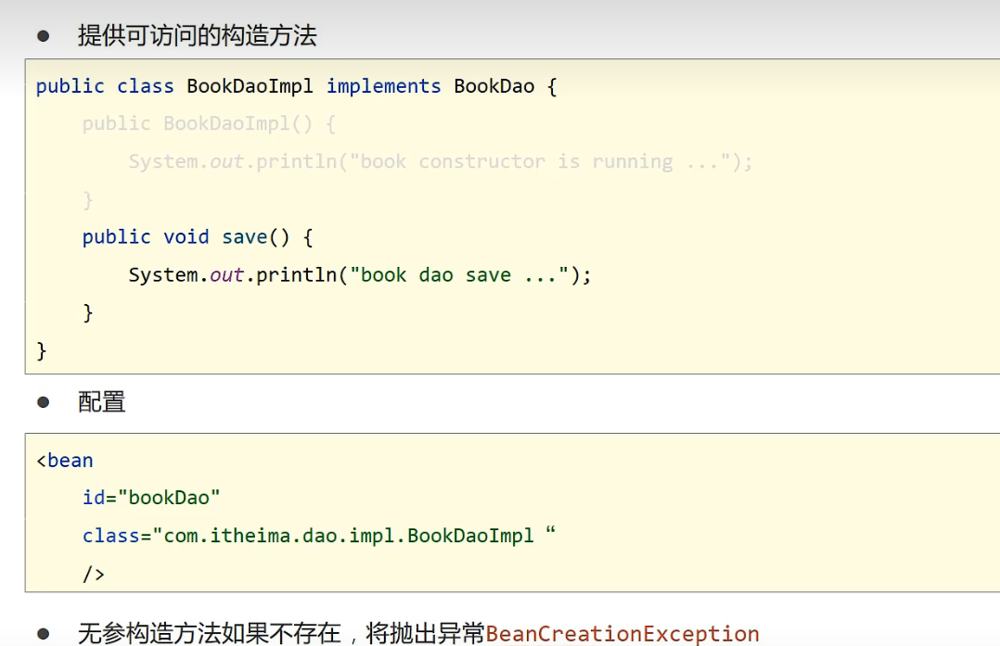


2.静态工厂

```xml
<bean id="orderfac" class="com.cx.factory.orderfac" factory-method="getOdrderDao"></bean>
```


3.实例工厂

```xml
  <bean id="userFactory" class="com.cx.factory.userfac"></bean>

    <bean id="userDao" factory-method="createUser" factory-bean="userFactory"></bean>
```


4.类实现实例工厂

```java
public class userDaoBeanFactory implements FactoryBean<userDao> {
    @Override
    public userDao getObject() throws Exception {
        return new userImpl();
    }
    @Override
    public Class<?> getObjectType() {
        return userDao.class;
    }
}
```


```xml
<!--    方式四-->
    <bean id="userDao" class="com.cx.factory.userDaoBeanFactory"></bean>
```


> DI

依赖注入，容器内建立bean与bean之间的依赖关系


在目标bean的类中去掉new对象的操作

```java
public void setBookDao(BookDao bookDao) {
    this.bookDao = bookDao;
}
```

```xml
<bean id="bookService" class="com.cx.service.impl.BookServiceImpl">
<!--        5.property表示配置当前bean的属性
            name表示配置哪个具体的属性
            ref表示参照哪一个bean-->
        <property name="bookDao" ref="bookImpl"></property>
    </bean>
    <bean id="bookImpl" class="com.cx.dao.impl.BookImpl"></bean>
```


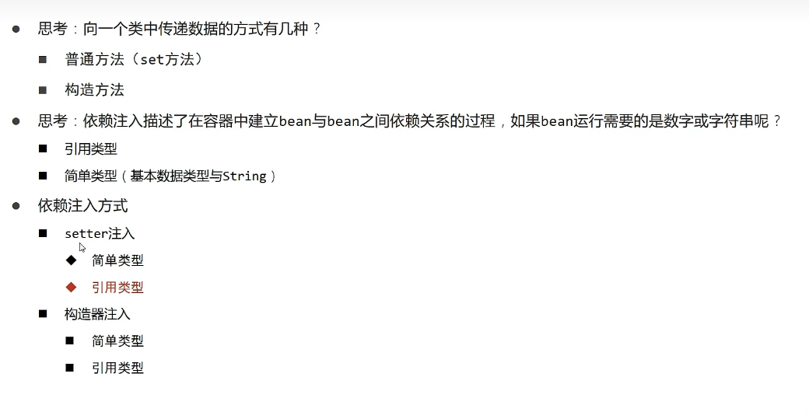


引用类型用ref 简单类型用value

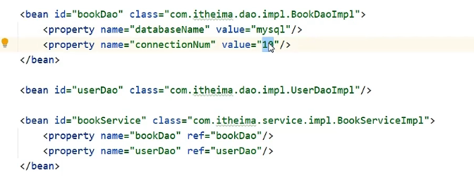

自动注入

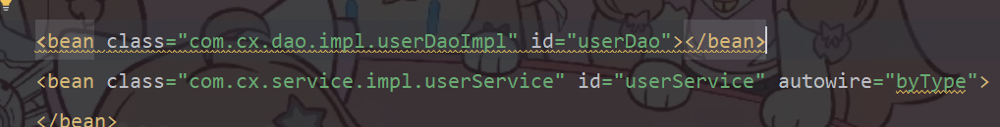

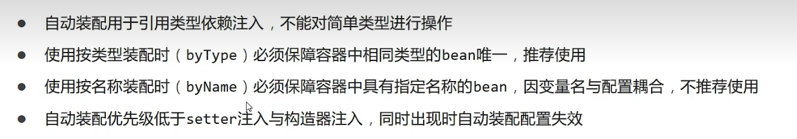

集合注入

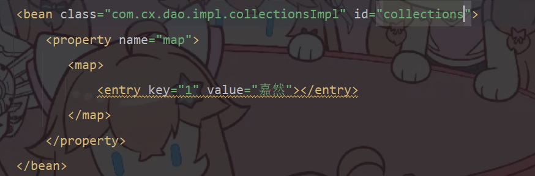

管理properties

在xml添加

```
xmlns:context="http://www.springframework.org/schema/context"
<-在下面的引号中添加->
xsi:schemaLocation="
 http://www.springframework.org/schema/context
       http://www.springframework.org/schema/context/spring-context.xsd“
       
       

```

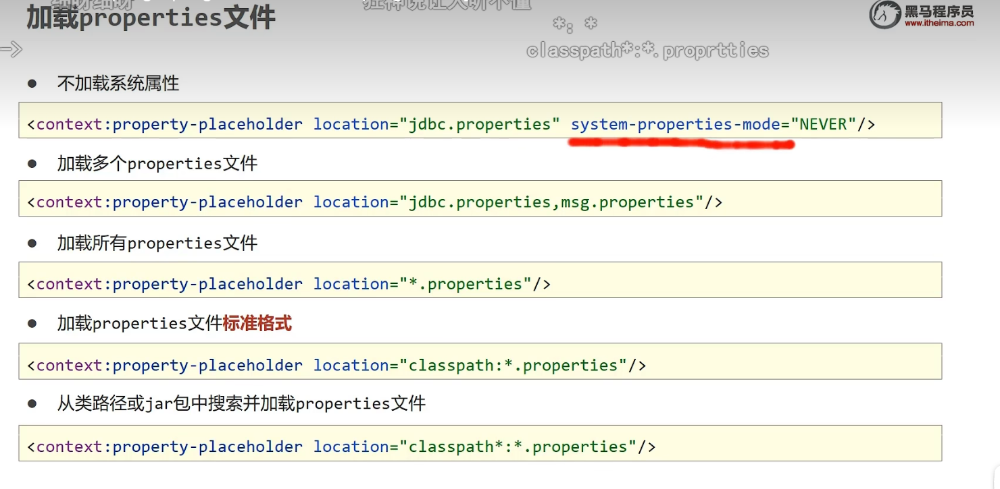


### 1.2容器

获取bean

```java
BookDao bookDao = (BookDap) ctx.getBean("bookDao");
BookDao bookDao = ctx.getBean("bookDao",BookDao.class);
BookDao bookDao = ctx.getBean(BookDao.class)
```


核心容器

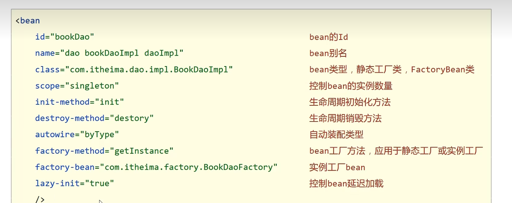

依赖注入

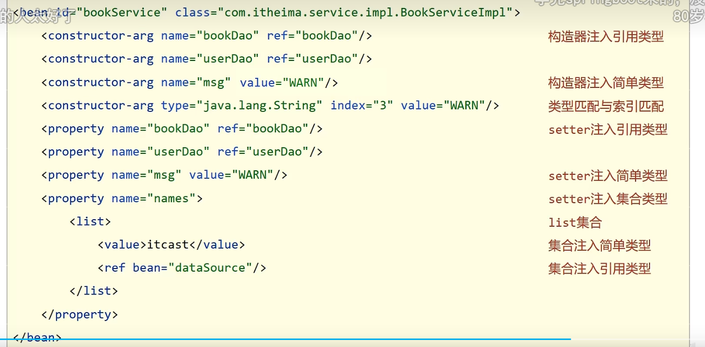

### 1.3注解开发

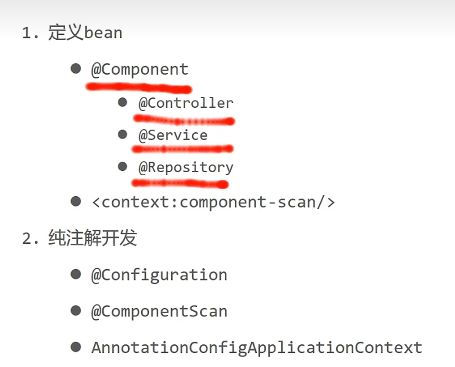

xml配置

```xml
<context:component-scan base-package="com.cx"/>
```

dao层配置

```java
@Component("bookDao")
```

service层配置

```java
@Service
```

#### 1.3.1纯注解开发

在一个类中写下

```java
@Configuration
@ComponentScan("com.cx")
```

再将获取ctx的改成

```java
ApplicationContext ctx = new AnnotationConfigApplicationContext(SpringConfig.class);
```

如果想改成单例对象设计，在那个类下写@scope；

#### 1.3.2依赖注入

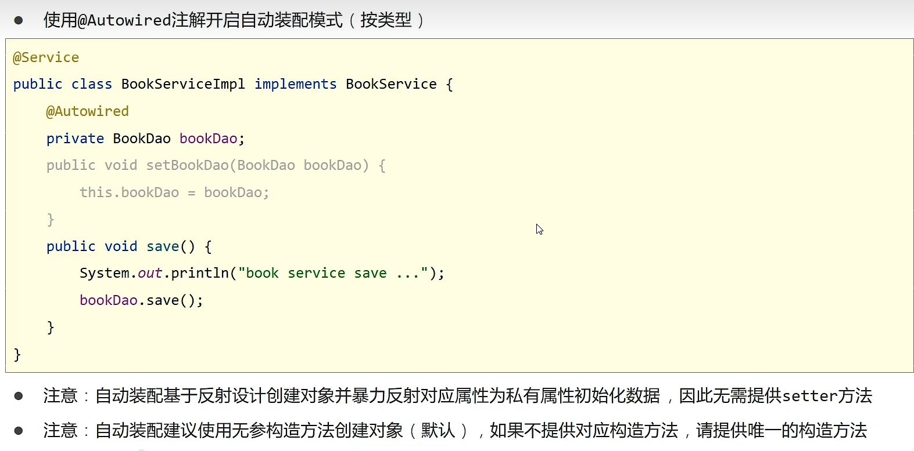

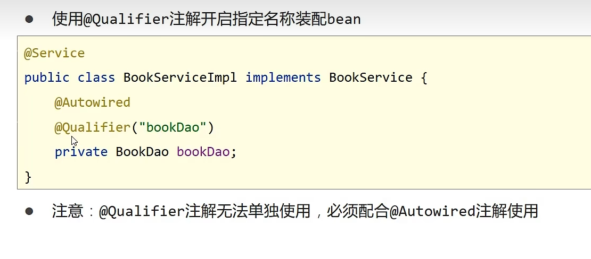

在那个类下加上

@AutoWired

//当有相同的bean时

@Qulifier("你想要注入的那个bean")

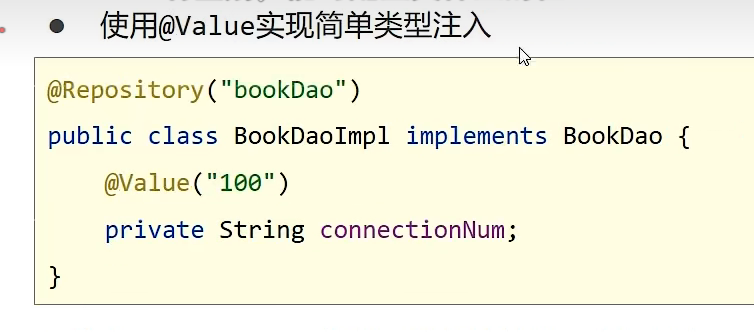


1.自动装配

- @Autowired
- @Qualifier
- @Value

2.读取properties文件

- @PropertySource


#### 注解与xml配置区别

| 功能           | xml配置                                                      | 注解                                                         |
| -------------- | ------------------------------------------------------------ | ------------------------------------------------------------ |
| 定义bean       | bean标签<br /> 1.id属性 <br />2.class属性                    | @Component <br />1.@Controller<br /> **2.@Service**<br />3.@Repository<br /> **@ComponentScan** |
| 依赖注入       | setter注入（set方法）<br />1.引用/简单<br />构造器注入（构造方法）<br />1.引用/简单<br />自动装配 | **@Autowired<br />**@Qulifier<br />@Value                    |
| 配置第三方bean | bean标签<br />静态工厂<br />实例工厂<br />FactoryBean        | @Bean                                                        |
| 作用范围       | scope属性                                                    | @Scope                                                       |
| 生命周期       | 标准接口<br />init-method<br />destroy-method                | @PostConstructor<br />@PreDestroy                            |
|                |                                                              |                                                              |


## 2.1AOP

我们把方法中的方法体作为连接点，

比如方法A,B,C，A中有个hello的代码，B,C没有，把Hello抽取出来，追加到B,C上，B,C就是切入点，Hello就叫通知

把Hello做成一个通知类中的方法，BC作为切入点，通知类与BC的关系就叫切面，

### 2.1.1入门案例

1.导包

```xml
<!--一个是spring框架，里面有aop的包，一个是aspectj，可以命名切片--> 
<dependency>
      <groupId>org.springframework</groupId>
      <artifactId>spring-context</artifactId>
      <version>5.2.7.RELEASE</version>
    </dependency>
    <dependency>
      <groupId>org.aspectj</groupId>
      <artifactId>aspectjweaver</artifactId>
      <version>1.9.4</version>
    </dependency>
```

2.定义一个类

```java
package com.cx.Aop;

import org.aspectj.lang.annotation.Aspect;
import org.aspectj.lang.annotation.Before;
import org.aspectj.lang.annotation.Pointcut;
import org.springframework.stereotype.Component;

//这里是将这个类定义成一个bean
@Component
//这里是将这个类成为一个切片
@Aspect
public class MyAdvice {
    //定义一个切入点方法，空的方法体，指定切入的方法
    @Pointcut("execution(void com.cx.dao.Impl.userDao.delete())")
    private void pt(){}

    //Before代表在这个方法前执行
    @Before("pt()")
    public void Before(){
        System.out.println(System.currentTimeMillis());
    }
}

```

3.交给spring管理

```java
package com.cx.config;

import org.springframework.context.annotation.ComponentScan;
import org.springframework.context.annotation.Configuration;
import org.springframework.context.annotation.EnableAspectJAutoProxy;

@Configuration
@ComponentScan("com.cx")
//这里可以自动管理切片
@EnableAspectJAutoProxy
public class SpringConfig {
}
```

### AOP切入点表达式


Aop注意，如果使用aop后，在main中使用getbean获得bean对象时，不能使用具体实现类得反射，需要使用接口的反射。


```
动作关键字(访问修饰符 返回值 包名.类/接口名.方法名(参数)异常名)
excution(public User com.cx.service.UserService.findById(int) )
```

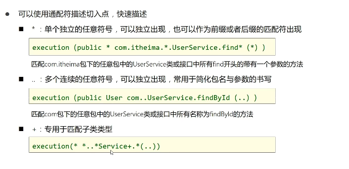

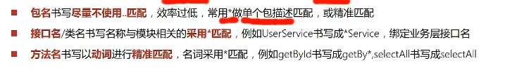

```
@Before
@After
@Around
Around通知里需要依赖形参ProceedingJoinPoint可实现对原始方法的调用，如果不返回值，用void，返回值的话就要Object类型，并用Object re = pjt.proceed();
return re;
```

