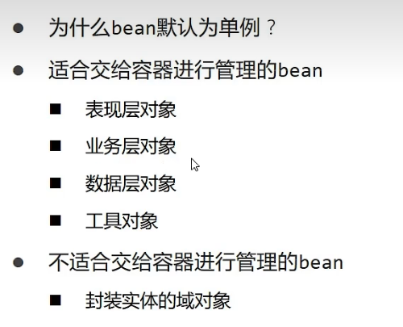

# Spring

## 1.1核心容器

### 1.1.1核心概念

> IOC

控制反转，不主动new对象，由**外部**提供对象，为了解耦

通过提供一个容器，IOC容器，

Ioc负责管理对象的创建，初始化一系列工作，被创建或被管理的对象在容器内统称为bean


1.xml配置

```xml
<?xml version="1.0" encoding="UTF-8"?>
<beans xmlns="http://www.springframework.org/schema/beans"
       xmlns:xsi="http://www.w3.org/2001/XMLSchema-instance"
       xsi:schemaLocation="http://www.springframework.org/schema/beans http://www.springframework.org/schema/beans/spring-beans.xsd">

<!--    1.导入spring -->

<!--    2.创建bean-->
    <bean id="bookService" class="com.cx.service.impl.BookServiceImpl"></bean>
    <bean id="bookImpl" class="com.cx.dao.impl.BookImpl"></bean>
</beans>
```

2.main中使用

```java
package com.cx;

import com.cx.dao.BookDao;
import com.cx.service.BookService;
import org.springframework.context.ApplicationContext;
import org.springframework.context.support.ClassPathXmlApplicationContext;

public class App2 {
    public static void main(String[] args) {
        //3.获取Ioc容器
        ApplicationContext ctx = new ClassPathXmlApplicationContext("applicationContext.xml");
        //4。获取bean
        BookDao bookDao = (BookDao) ctx.getBean("bookImpl");
        bookDao.save();

        BookService bookService =(BookService) ctx.getBean("bookService");
        bookService.save();
    }
}
```

1. bean的name

   可以起别名

2. scope

   singleton：单例（默认）

   prototype：非单例



  


实例化bean的三种方式

1.构造方法


2.静态工厂

```xml
<bean id="orderfac" class="com.cx.factory.orderfac" factory-method="getOdrderDao"></bean>
```


3.实例工厂

```xml
  <bean id="userFactory" class="com.cx.factory.userfac"></bean>

    <bean id="userDao" factory-method="createUser" factory-bean="userFactory"></bean>
```


4.类实现实例工厂

```java
public class userDaoBeanFactory implements FactoryBean<userDao> {
    @Override
    public userDao getObject() throws Exception {
        return new userImpl();
    }
    @Override
    public Class<?> getObjectType() {
        return userDao.class;
    }
}
```


```xml
<!--    方式四-->
    <bean id="userDao" class="com.cx.factory.userDaoBeanFactory"></bean>
```


> DI

依赖注入，容器内建立bean与bean之间的依赖关系


在目标bean的类中去掉new对象的操作

```java
public void setBookDao(BookDao bookDao) {
    this.bookDao = bookDao;
}
```

```xml
<bean id="bookService" class="com.cx.service.impl.BookServiceImpl">
<!--        5.property表示配置当前bean的属性
            name表示配置哪个具体的属性
            ref表示参照哪一个bean-->
        <property name="bookDao" ref="bookImpl"></property>
    </bean>
    <bean id="bookImpl" class="com.cx.dao.impl.BookImpl"></bean>
```


