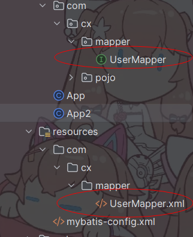
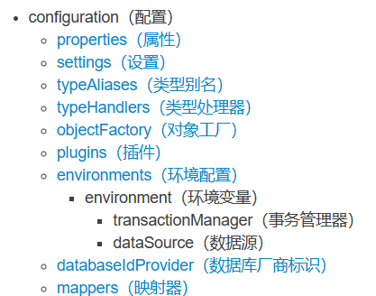
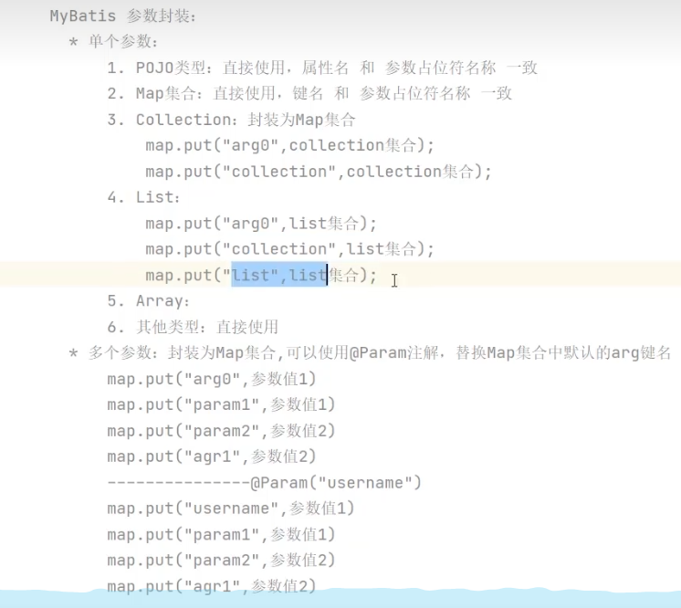

[mybatis – MyBatis 3 | 入门](https://mybatis.org/mybatis-3/zh/getting-started.html)

首先是这个框架

# Mybatis使用


## 1.入门使用

1.导入jar包

```xml
<dependency>
      <groupId>org.mybatis</groupId>
      <artifactId>mybatis</artifactId>
      <version>3.5.5</version>
</dependency>
```

2.配置xml文件

```xml
<!--mybatis-config.xml-->

<?xml version="1.0" encoding="UTF-8" ?>
<!DOCTYPE configuration
        PUBLIC "-//mybatis.org//DTD Config 3.0//EN"
        "https://mybatis.org/dtd/mybatis-3-config.dtd">
<configuration>
    <environments default="development">
        <environment id="development">
            <transactionManager type="JDBC"/>
            <dataSource type="POOLED">
                <property name="driver" value="com.mysql.cj.jdbc.Driver"/>
                <property name="url" value="jdbc:mysql://localhost:3306/springdemo"/>
                <property name="username" value="root"/>
                <property name="password" value="root"/>
            </dataSource>
        </environment>
    </environments>
    
    <mappers>
<!--        加载sql映射文件-->
        <mapper resource="UserMapper.xml"/>
</mappers>
</configuration>
```

3.创建对应的mapper文件

```xml
<!--UserMapper.xml-->

<?xml version="1.0" encoding="UTF-8" ?>
<!DOCTYPE mapper
        PUBLIC "-//mybatis.org//DTD Mapper 3.0//EN"
        "https://mybatis.org/dtd/mybatis-3-mapper.dtd">

<!--命名空间-->
<mapper namespace="org.mybatis.example.BlogMapper">
    <select id="selectAll" resultType="com.cx.pojo.User">
        select * from tb_user
    </select>
</mapper>
```

4.创建映射文件

在上面的mybatis-config.xml文件中加入

```xml
<mappers>
<!--        加载sql映射文件-->
        <mapper resource="UserMapper.xml"/>
</mappers>
```

5.测试

```java
  		//获取核心配置
		String resource = "mybatis-config.xml";
        InputStream inputStream = Resources.getResourceAsStream(resource);
        SqlSessionFactory sqlSessionFactory = new SqlSessionFactoryBuilder().build(inputStream);
		
		//获取执行sqlsession
        SqlSession session = sqlSessionFactory.openSession();
		
		//执行查询
        List<User> userList = session.selectList("test.selectAll");
        System.out.println(userList);
		//关闭资源
        session.close();

//假如出现报错，就看看是不是时区问题，在

```

[IDEA报错：java.sql.SQLException: The server time zone value ‘�й���׼ʱ��‘ is unrecognized or represents.._idea the server time zone value ‘ й-CSDN博客](https://blog.csdn.net/YyjYsj/article/details/111192410)


## 2.代理开发

使用接口来代理mapper，这样每次使用mapper时有提示

1. 首先创建一个接口，要和xml的mapper名字相同

2. 

   这里注意resources的包创建时要用“/”创建

   ```
   com/cx/mapper
   ```

3. 修改xml文件的命名空间

   ```xml
   <!--修改成接口位置-->
   <mapper namespace="com.cx.mapper.UserMapper">
       <select id="selectAll" resultType="com.cx.pojo.User">
           select * from tb_user;
       </select>
   </mapper>
   ```

   修改config的文件

   ```xml
   <mapper resource="com/cx/mapper/UserMapper.xml"/>
   <!--修改成包扫描-->
   <package name="com.cx.mapper"/>
   ```

4. 接口添加方法

   ```java
   //方法名要改成select的id
   public interface UserMapper {
       List<User> selectAll();
   }
   ```

main方法修改

```java
String resource = "mybatis-config.xml";
        InputStream inputStream = Resources.getResourceAsStream(resource);
        SqlSessionFactory sqlSessionFactory = new SqlSessionFactoryBuilder().build(inputStream);

        SqlSession session = sqlSessionFactory.openSession();

		//修改成mapper映射
        UserMapper um = session.getMapper(UserMapper.class);
        List<User> userList = um.selectAll();
        System.out.println(userList);

        session.close();
```


## 3.配置文件



要按照顺序配置

### 1.环境配置

environments：配置数据库连接环境信息，可以配置多个environment，通过default属性切换不同的environment

### 2.类型别名

加了类型别名指定的包，里面的类可以用小写，不需要每个字母大小写都对的上

```xml
<typeAliases>
        <package name="com.cx.pojo"/>
    </typeAliases>
```

### 3.将数据库列名对应实体类

```xml
<resultMap id="BrandResultMap" type="Brand">
    <result property="brandName" column="brand_name" />
    <result property="companyName" column="company_name"/>
</resultMap>
```

在对应mapper上的resultType要写成resultMap

```xml
resultMap="BrandResultMap"
```

## 4.增删改查

### 1.条件查询的mapper

```xml
<mapper namespace="com.cx.mapper.BrandMapper">
    <resultMap id="BrandResultMap" type="Brand">
        <result property="brandName" column="brand_name" />
        <result property="companyName" column="company_name"/>
    </resultMap>
    <select id="selectById" parameterType="int" resultMap="BrandResultMap">
        select * from tb_brand where id = #{id}
    </select>
</mapper>
```

参数占位符：

​	1.#{}：会将其替换成？，为了防止sql注入

​	2.${}：拼sql，会存在sql注入问题

​	3.使用时机：

​		*参数传递时：#{}

​		*表名或列名不固定时:${}会存在Sql注入的问题

参数类型：parameterType：可以省略

特殊字符处理：

​	1.转义字符

​	2.CDATA区

### 2.多条件查询的mapper

```xml
<select id="selectByCondition" resultMap="BrandResultMap">
    select *
    from tb_brand
    where
        status = #{status}
        and company_name like #{companyName}
        and brand_name like #{brandName}
</select>
```

```java

 int status = 1;
        String companyName = "华为";
        String brandName = "华为";
        companyName = "%"+companyName+"%";
        brandName = "%"+brandName +"%";
//        Map map = new HashMap();
//        map.put("status",status);
//        map.put("companyName",companyName);
//        map.put("brandName",brandName);


//散装参数，sql占位符Param
List<Brand> selectByCondition(@Param("status")int status,@Param("companyName")String companyName,@Param("brandName")String brandName);

//封装类，sql参数名和类名对应上
List<Brand> selectByCondition(Brand brand);

//map集合传参，保证sql参数名和map键对应上
List<Brand> selectByCondition(Map map);

```

模糊查询中，要在main中加”%“占位符

```java
List<Brand> brand = brandMapper.selectByCondition(1,null,null);
在测试类中假如有未输入的情况，会出现[]
    对mapper进行如下修改
```

```xml
<select id="selectByCondition" resultMap="BrandResultMap">
    select *
    from tb_brand
    <where>
    <if test="status != null">
        and status = #{status}
    </if>
    <if test="companyName != null and companyName != '' ">
        and company_name like #{companyName}
    </if>
    <if test="brandName != null and brandName != '' ">
        and brand_name like #{brandName}
    </if>
    </where>
</select>
```

### 3.单条件查询

要考虑一下没有输入的情况

```xml
<!--choose when相当于switch case ，otherwise就是default，无输入时就会全查出来，也可以用where动态查询，会自动检测有无输入的情况-->

<select id="selectByConditionSingle" resultMap="BrandResultMap">
    select *
    from tb_brand
    where
    <choose>
        <when test="status != null">
            status = #{status}
        </when>
        <when test="companyName != null and companyName != '' ">
            company_name like #{companyName}
        </when>
        <when test="brandName != null and brandName != '' ">
            brand_name like #{brandName}
        </when>
        <otherwise>
            1=1
        </otherwise>
    </choose>

</select>
```

使用where动态查

```xml
<select id="selectByConditionSingle" resultMap="BrandResultMap">
    select *
    from tb_brand
    <where>
    <choose>
        <when test="status != null">
            status = #{status}
        </when>
        <when test="companyName != null and companyName != '' ">
            company_name like #{companyName}
        </when>
        <when test="brandName != null and brandName != '' ">
            brand_name like #{brandName}
        </when>
      </choose>
        </where>
</select>
```

### 4.添加


```xml
<insert id="add" useGeneratedKeys="true" keyProperty="id">
    insert into tb_brand(brand_name,company_name,ordered,description,status)
    values (#{brandName},#{companyName},#{ordered},#{description},#{status})
</insert>
```

在使用useGenerateKeys="true"，keyProperty = “id”可以获取插入的类id，自动递增时

```java
int id = brand.getId();
```

### 5.修改

使用if标签可以动态修改数据库，修改部分字段

```xml
<update id="updateById">
    update tb_brand
    <set>
        <if test="brandName != null and brandName != '' ">
            brand_name = #{brandName},
        </if>
        <if test="companyName != null and companyName != ''">
            company_name = #{companyName},
        </if>
        <if test="ordered != null">
            ordered= #{ordered},
        </if>
        <if test="description != null">
            description = #{description},
        </if>
        <if test="status != null">
            status = #{status}
        </if>
    </set>
    where id = #{id}
</update>
```

### 6.删除

删除单个

```xml
<delete id="deleteById">
    delete from tb_brand where id = #{id}
</delete>
```

删除多个

```xml
<delete id="deleteByIds">
    delete from tb_brand where id
    in(
        <foreach collection="ids" item="id" separator=",">
            #{id}
        </foreach>
    );
</delete>
```

```java
void deleteByIds(@Param("ids") int[] ids);
```

## 5.深入mybatis

### mybatis核心对象

SqlSession负责执行sql语句，是一个java程序与数据库之间一次会话

SqlSessionFactoryBuilder

SqlSessionFactory

SqlSession

```java
		String resource = "mybatis-config.xml";
        InputStream inputStream = Resources.getResourceAsStream(resource);
        SqlSessionFactory sqlSessionFactory = new SqlSessionFactoryBuilder().build(inputStream);
        SqlSession session = sqlSessionFactory.openSession();
```

## 6.mybatis集成日志文件

在mybatis-config.xml中settings开启

```java
<!--mybatis自己在框架中实现的日志，下面代码用于开启-->
    <!--这是默认，不用引入jar包-->
<settings>
        <setting name="logImpl" value="STDOUT_LOGGING"/>
    </settings>
```


引入logback依赖

1.引入Logback依赖

```xml
<dependency>
  <groupId>ch.qos.logback</groupId>
  <artifactId>logback-classic</artifactId>
  <version>1.4.5</version>
  <scope>test</scope>
</dependency>
```

2.引入Logback的xml配置文件

7.整合成一个工具类


## 注意点：

接口每次设置多个参数传进来时，要加@Param（“对应实体类名称”）（就是sql属性占位符）


mybatis不会自动提交，需要在main中


```java
SqlSession session = sqlSessionFactory.openSession(true);//在这里填上true

//或者在下面直接
session.commit();
```



## 注解

把sql语句写在接口方法上

简单sql用注解，复杂sql用xml

```java
@Select("select * from tb_Brand where id = #{id}")
```
