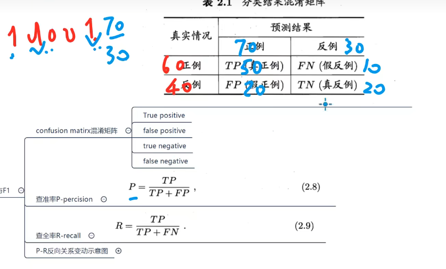

## 1.模型评估与选择：


### 一种训练集一种算法：

1.1经验误差和过拟合：

```
m样本数量，比如10000张手写字体图片

Y样本正确的结果，第一章图片是1，第二章是7

使用模型进行预测，一万张图片进行判断，预测的结果是Y^

a个错了，error rate：E = a/m
accuracy-精度：1-E
error误差：|Y-Y^|
```

1.2评估方法：

```
泛化能力：模型对没有见过的数据的预测能力
		训练集vs测试集
trainning set训练集
testing set测试集的保留方法
//就是几成训练，几成预测
	留出法：
	1.三七分，二八分；
	2.注意训练集和测试集同分布；
	3.多次随机划分，训练出多个模型，取平均值
	交叉验证法：
	自助法：
validation set验证集：
	调参
```

1.3性能度量：

performance management


1.3.2查准率




### 一种训练集多种算法：


### 多种训练集一种算法：


### 测试集上的性能能再多大程度上保证真实的性能