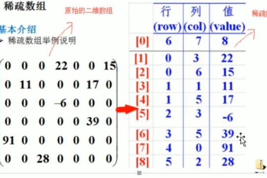
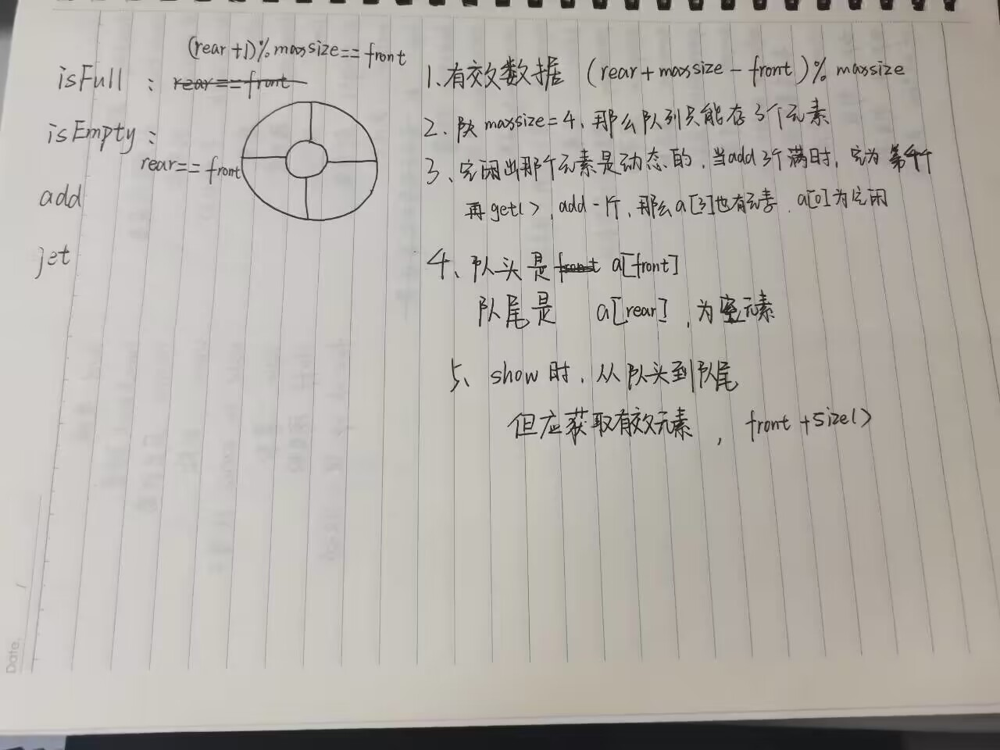

# 数据结构与算法


## 1.稀疏数组

一个数组大部分元素为0，为同一值

> 处理

记录数组一共1几行几列，有多少不同的值

不同值得元素得行列及值放在一个小数组，记录（行，列，值）




> 思路分析

稀疏数组：

  

| 元素 | row  | col  | val  |
| ---- | ---- | ---- | ---- |
| 0    | 11   | 11   | 2    |
| 1    |      |      |      |
| 2    |      |      |      |

二维转稀疏

1.遍历原始二维数组，得有效数据sum

2.根据sum创建sparseArr int[sum+3】【3】

3.有效数据存到稀疏数组

稀疏转二维

1.读取稀疏第一行，创建原始

2.读取后再读取各个位置

```java
public class parseArr {

	public static void main(String[] args) {
		// TODO Auto-generated method stub
		System.out.println("数组原型");
		int arr[][] =  new int[11][11];
		arr[1][2]=3;
		arr[2][4]=5;
		int count = 0;
		for(int i = 0; i<arr.length;i++) {
			System.out.println();
			for(int j = 0;j<arr[i].length;j++) {
				System.out.print(arr[i][j]+" ");
				if(arr[i][j]!=0) {
					count++;
				}
			}
		}
		
		System.out.println("\n\n转换稀疏数组,获取数组大小,不为0元素的个数"+count);
		
		int parseNum[][]= new int[count+1][3];
		//记录行 列 val
		parseNum[0][0] = 11; parseNum[0][1] = 11;parseNum[0][2] = count;
		//赋值
		int row = 1, colum =0;
		for(int i = 0; i<arr.length;i++) {
			for(int j = 0;j<arr[i].length;j++) {
				if(arr[i][j]!=0) {
					//记录ij值，
					parseNum[row][0] =i;
					parseNum[row][1] =j;
					parseNum[row][2] = arr[i][j];
					row++;	
				}
			}
		}
		//展示
		for(int i = 0 ;i<parseNum.length;i++) {
			System.out.println();
			for(int j = 0;j<parseNum[i].length;j++) {
				System.out.print(parseNum[i][j]+"\t");
			}
		}
		System.out.println("\n\n转换为原数组");
		
		//转换为原数组,先获取行列
		int realNum[][] =  new int[parseNum[0][0]][parseNum[0][1]];
		for(int i = 0; i<parseNum[0][2];i++) {
			realNum[ parseNum[i+1][0] ][ parseNum[i+1][1] ] =parseNum[i+1][2];
		}
		
		for(int i = 0; i<realNum.length;i++) {
			System.out.println();
			for(int j = 0;j<realNum[i].length;j++) {
				System.out.print(realNum[i][j]+" ");
			}
		}
		
	}
}

```


## 2.队列


数组模拟队列

front前端

 rear后端

> 构造

先创建队列，front = -1，rear = -1；

```java
isFull();//判断是否满

isEmpty();//判断是否空

addQueue();//添加数据 

getQueue();//取数据,

showQueue();//遍历数据

peek();//显示头部数据

headQueue();//显示队列的头数据，
```


尾指针向后移：rear+1 front = rear（空）

```java
class ArrayQ{
	//一次性队列
	private int maxsize;
	private int front;//指向队首
	private int rear;//指向队尾
	private int[] Arr;
/*
 * 添加数据，rear++,*/
	
	public ArrayQ(int maxsize) {
		this.maxsize = maxsize;
		Arr = new int[maxsize];
		front = -1;
		rear = -1;
	}
	
	//判断是否满
	//maxsize-1数组最后一位
	public boolean isFull() {
		return rear==maxsize-1;
	}
	
	//判断是否为空
	public boolean isempty() {
		return front == rear;
	}
	
	//添加数据
	public void addQueue(int num) {
		if(isFull()) {
			System.out.println("队列已满");
			return;
		}
		rear++;
		Arr[rear] = num;
	}
	
	//取数据
	public int getQueue() {
		if(isempty()) {
			throw new RuntimeException("队列为空");
		}
		front++;
		return Arr[front];
	}
	
	//遍历数据
	public void showQueue() {
		if(isempty()) {
			throw new RuntimeException("队列为空");
		}
		for(int i=0;i<maxsize;i++) {
			System.out.print(Arr[i]+" ");
		}
	}
	
	//观察头数据
	public void peek() {
		if(isempty()) {
			System.out.println("队列为空");
			return;
		}
		System.out.printf("a[0]=%d",Arr[front+1]);
	}
	
	public int headQueue() {
		if(isempty()) {
			throw new RuntimeException("队列为空");
		}
		return Arr[front+1];
		
	}
```


> 环形队列




```java
/*
 * 实现环形队列:
 * 
 * 1.isFull(): (rear+1)%maxsize = front，一个maxsize是一个轮回，
 * 	  每次满时，rear和front之间有一个元素空着
 * 2.isEmpty():front == rear
 * 3.add():进队列
 * 4.get():出队列
 * 5.peek():给出队头元素
 * 6.size():给出有效元素
 * */


class CircleQ{
	
	private int maxsize;
	public int front;//指向队首
	public int rear;//指向队尾
	private int[] Arr;
	
	public CircleQ(int ArrMaxsize) {
		Arr = new int[ArrMaxsize];
		maxsize = ArrMaxsize;
	}
	
	public boolean isFull() {
		return (rear+1)%maxsize == front;
	}
	
	public boolean isEmpty() {
		return rear == front;
	}
	
	public void add(int n) {
		if(isFull()) {
			System.out.println("队列已满");
			return;
		}
		Arr[rear] = n;
		rear = (rear+1)%maxsize;
	}
	
	public int get() {
		if(isEmpty()) {
			throw new RuntimeException("队列为空");
		}
//		return Arr[front];直接return会造成后面不能加加，除非使用谭浩强写法

		int value = Arr[front];
		front = (front+1)%maxsize;
		return value;
	}
	
	//只返回值，不改变位置
	public int peek() {
		if(isEmpty()) {
			throw new RuntimeException("队列为空");
		}
		return Arr[front];
	}
	
	//
	public void show() {
		if(isEmpty()) {
			System.out.println("队列为空");
			
		}
		for(int i = front;i < front+size();i++) {
			System.out.printf("a[%d] = %d ",i%maxsize,Arr[i%maxsize]);
		}
	}
	
	public int size() {
		return (rear+maxsize-front)%maxsize;
	}
}

```

> 所需几个算法

1.初始：front和rear都指向0，front指向队头，rear指向队尾元素的下一个元素；

每次add时，rear移动，每次get时front移动；

2.rear = （rear+1）%maxsize，这是rear每次移动的选择，当rear添加到最后一个元素，这时一个周期完成，从0开始（a[0]为空）

3.size = (rear+maxsize-front)%maxsize;


## 4.链表练习学生管理系统

```c++
//学生管理系统
#include <iostream>
#include <vector>
using namespace std;

//存储学生信息数据
class Student {
	public:
		string studentNo;
		string studentName;
		Student(string No, string Name) {
			this->studentNo = No;
			this->studentName = Name;
		}
		friend ostream &operator<<(std::ostream &os, const Student &obj) {
			os << "学生" << obj.studentNo << "姓名为" << obj.studentName ;
			return os;
		}
};

class node {
	public:
		Student data;
		node *next;
		node(Student sdata): data(sdata), next(nullptr) {}
};

class Student_List {
	public:
		Student_List(vector<Student> stu);
		//遍历学生
		void print();
		//增加学生
		void add_stu(Student stu);
		//删除指定学号的学生，如果删除成功返回true，如果没找到学号返回false
		bool delete_stu(string No);
		// 按照给定的学号查询学生记录，如果找到成功返回true，如果没找到学号返回false
		bool query_stu(string No);
		// 按照给定的学号找到学生记录节点，如果修改成功返回true，如果没找到学号返回false
		bool modify_stu(Student stu);

	private:
		node *head;

};

Student_List::Student_List(vector<Student> stu) {
	head = new node(Student("", ""));
	head->next = nullptr;
	node *temp = head;
	for (int i = 0; i < stu.size(); i++) {
		temp->next = new node(stu[i]);
		temp = temp->next;
	}
}

void Student_List::print() {
	//先判断是否为空
	if (head->next == nullptr) {
		cout << "学生系统为空" << endl;
	}
	node *temp = head->next;
	while (temp != nullptr) {
		cout << temp->data << endl;
		temp = temp->next;
	}
}

//增加学生
void Student_List::add_stu(Student stu) {
	node *temp = head->next;
	while (temp->next != nullptr) {
		temp = temp->next;
	}
	temp->next = new node(stu);
}

//删除指定学号的学生，如果删除成功返回true，如果没找到学号返回false
bool Student_List::delete_stu(string No) {
	if (head->next == nullptr)
		return false;
	node *temp = head;
	while (temp->next != nullptr && temp->next->data.studentNo != No) {
		temp = temp->next;

	}
	if (temp->next == nullptr)
		return false;
	node *dele = temp->next;
	temp->next = temp->next->next;
	delete dele;
	return true;
}

// 按照给定的学号查询学生记录，如果找到成功返回true，如果没找到学号返回false
bool Student_List::query_stu(string No) {
	if (head->next == nullptr)
		return false;
	node *temp = head;
	while (temp->next != nullptr && temp->next->data.studentNo != No) {
		temp = temp->next;
	}
	if (temp->next == nullptr)
		return false;

	cout << temp->next->data;
	return true;
}

// 按照给定的学号找到学生记录节点，如果修改成功返回true，如果没找到学号返回false
bool Student_List::modify_stu(Student stu) {
	if (head->next == nullptr)
		return false;
	node *temp = head;
	while (temp->next != nullptr && temp->next->data.studentNo != stu.studentNo) {
		temp = temp->next;
	}
	if (temp->next == nullptr)
		return false;

	temp->next->data = stu;
	cout << "修改后:\n" << temp->next->data << endl;
	return true;

}


int main() {

	vector<Student> sts = {
		Student("0", "嘉然"),
		Student("1", "向晚"),
		Student("2", "乃琳"),
		Student("3", "贝拉"),
		Student("4", "嘉乐")
	};

	//当使用new Class会在堆中创建一个对象，返回一个指针，所以需要使用*s接收
	//而当使用Student_List S1时，则会在栈中创建一个对象，
	Student_List *s1 = new Student_List(sts);
	//new之后需要使用指针接收
	s1->add_stu(Student("6", "冬雪莲"));
	s1->print();

	cout << "-------测试删除-------" << endl;

	if (s1->delete_stu("5")) {
		cout << "成功删除" << endl;
	} else {
		cout << "失败删除" << endl;
	}

	cout << "-------测试查询-------" << endl;
	if (s1->query_stu("10")) {
		cout << "成功查询" << endl;
	} else {
		cout << "失败查询" << endl;
	}

	cout << "-------测试修改-------" << endl;
	if (s1->modify_stu(Student("7", "永雏塔菲"))) {
		cout << "成功修改" << endl;
	} else {
		cout << "失败修改" << endl;
	}


//	s1->print();


	delete s1;
	return 0;
}
```

1.new的class是在堆里创建的，并且返回一个指针。所以经常都需要用*obj接收

2.在函数接收其他class作为参数时，要注意不要用new Class()，直接使用Class()就好

3.在进行插入，删除，查询时，可以把temp在目标元素的前一个位置停下，这样在判断是否next为空时，当next为空，说明没有匹配的并且到了末尾，这时遍历完所有的节点了，所以直接返回false，并且要注
